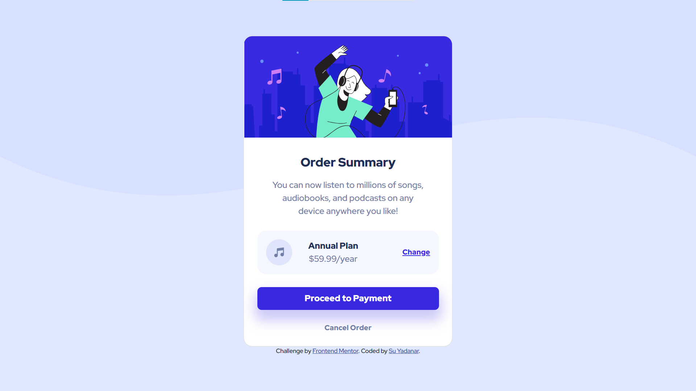

# Frontend Mentor - Order summary card solution

This is a solution to the [Order summary card challenge on Frontend Mentor](https://www.frontendmentor.io/challenges/order-summary-component-QlPmajDUj). Frontend Mentor challenges help you improve your coding skills by building realistic projects. 

## Table of contents

- [Overview](#overview)
  - [The challenge](#the-challenge)
  - [Screenshot](#screenshot)
  - [Links](#links)
- [My process](#my-process)
  - [Built with](#built-with)
  - [What I learned](#what-i-learned)
  - [Useful resources](#useful-resources)
- [Author](#author)

## Overview

### The challenge

Users should be able to:

- See hover states for interactive elements

### Screenshot

### Links

- Solution URL: [Add solution URL here](https://your-solution-url.com)
- Live Site URL: [Add live site URL here](https://your-live-site-url.com)

## My process

### Built with

- HTML5
- CSS custom properties
- Bootstrap V5.1.3

### What I learned

I learned the differences betweern 'rem' and 'px' and how to use them. Also the benifits and disadvandages of using them.

### Useful resources

- [Why designers should move from px to rem](https://uxdesign.cc/why-designers-should-move-from-px-to-rem-and-how-to-do-that-in-figma-c0ea23e07a15) - This helped me to understand between 'rem' and 'px' units.

## Author

- GitHub - [SYadanar](https://github.com/SYadanar)
- Frontend Mentor - [@SYadanar](https://www.frontendmentor.io/profile/SYadanar)
